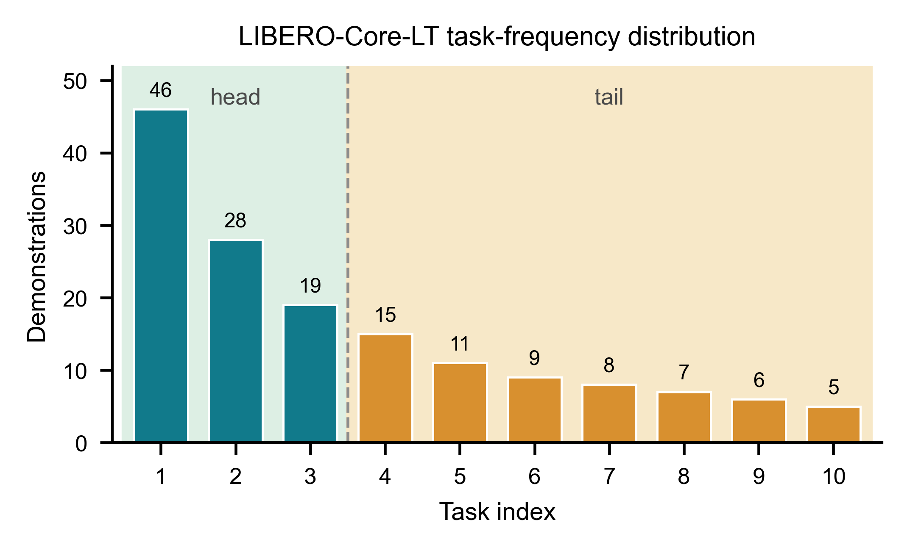
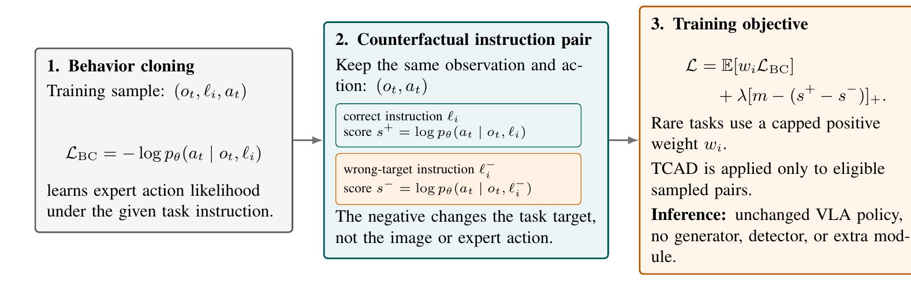
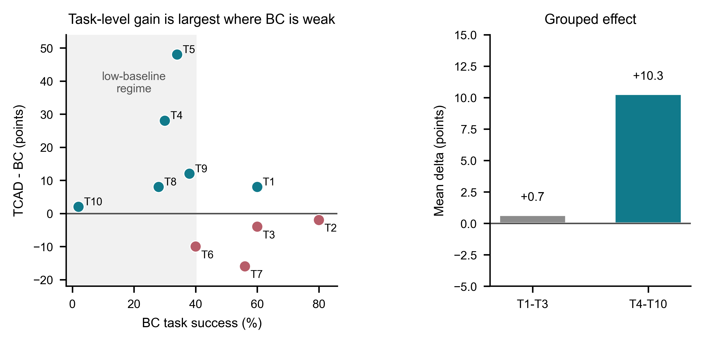

# RBTAD-TCAD

**Rare-Balanced Task-Conditioned Action Discrimination (RBTAD)** is a preliminary, training-only method for long-tailed embodied imitation learning. It keeps the baseline VLA architecture and inference path unchanged, but adds a task-conditioned action discrimination objective during fine-tuning.

This repository contains the working code and manuscript sources for the current technical-report draft. The draft is intentionally conservative: the current evidence is promising, but it is not yet a final multi-seed benchmark paper.

Current manuscript: [`paper/rbtad_tcad_arxiv_draft_v2.pdf`](paper/rbtad_tcad_arxiv_draft_v2.pdf)

## Motivation

Long-tailed embodied imitation datasets contain a few frequent head tasks and many rare tail tasks. In LIBERO-Core-LT, the first three tasks dominate the demonstrations, while the remaining seven tail tasks receive much weaker positive supervision.



RBTAD targets a specific failure mode: a policy may assign similar likelihood to the same expert action under the correct instruction and under a plausible but wrong target instruction. The method regularizes this local task/action boundary while preserving the standard behavior-cloning pathway.

## Method Overview

RBTAD keeps the standard behavior-cloning pathway, constructs a plausible counterfactual instruction for selected training samples, and adds a mild ranking objective that encourages the correct instruction score to exceed the wrong-instruction score. Rare-aware positive weighting prevents tail demonstrations from being numerically drowned out, while inference remains identical to the baseline policy.



## Main Results

The table below compares the current RBTAD result with the reported LIBERO-Core-LT baselines from *Beyond the Majority*. RBTAD is our current single-seed run, so it should be read as controlled preliminary evidence rather than a final SOTA claim.

| Family | Method | Success rate |
| --- | --- | ---: |
| BC | Original distribution | 26.5% |
| Re-sampling | q = 0.75 | 25.1% |
| Re-sampling | q = 0.50 | 25.1% |
| Re-sampling | q = 0.25 | 27.1% |
| APA ablation | Formatting only | 26.0% |
| APA ablation | Augmentation only | 26.9% |
| APA | Formatting + augmentation | 36.1% |
| Ours | RBTAD | **40.0%** |

RBTAD obtains the 40.0% result without generated approach demonstrations, object grafting, extra inference-time modules, or changes to the learned policy architecture.

## Controlled Counterpart

We also ran a controlled LIBERO-Core-Full counterpart experiment using the same local pipeline, seed, and evaluation budget.

| Dataset | Method | Success rate |
| --- | --- | ---: |
| LIBERO-Core-Full | BC baseline | 43.0% |
| LIBERO-Core-Full | TCAD-trained | **50.0%** |
| LIBERO-Spatial-LT | BC baseline, seed 7 matched 30 trials/task | 19.0% |
| LIBERO-Spatial-LT | RSDF vision+LLM, seed 7 matched 30 trials/task | **25.0%** |
| LIBERO-Spatial-LT | BC baseline, seed 13 matched 30 trials/task | 17.0% |
| LIBERO-Spatial-LT | RSDF vision+LLM, seed 13 matched 30 trials/task | 18.0% |

The task-level analysis below shows that the Core-Full gain is not a uniform lift across all tasks. Improvements concentrate in lower-baseline tasks and in tasks 4-10, which supports the view that TCAD helps sharpen difficult task-conditioned action boundaries.



## Spatial-LT RSDF Screening

LIBERO-Spatial-LT is a second simulated long-tail split built from LIBERO-Spatial tasks. Unlike LIBERO-Core-LT, these tasks share the same manipulated object and final goal but differ mainly in the source spatial relation. This makes naive replay and full-run reweighting brittle: the model must correct relation grounding without damaging the embodied policy learned by the baseline.

The current best Spatial-LT method is **Relation-Localized Delta Fusion (RSDF)**. RSDF first obtains a short baseline-anchored relation-correction checkpoint, then fuses only the `vision_backbone` and `llm_backbone` deltas into the baseline while keeping the projector fixed. It adds no inference-time module and does not change the policy architecture.

| Dataset | Seed | Method | Trials/task | Success rate |
| --- | ---: | --- | ---: | ---: |
| LIBERO-Spatial-LT | 7 | BC baseline | 30 | 19.0% |
| LIBERO-Spatial-LT | 7 | RSDF vision+LLM | 30 | **25.0%** |
| LIBERO-Spatial-LT | 13 | BC baseline | 30 | 17.0% |
| LIBERO-Spatial-LT | 13 | RSDF vision+LLM | 30 | 18.0% |

Task-level Spatial-LT seed 7 result: baseline `[.50, .00, .20, .47, .17, .00, .40, .00, .17, .00]`; RSDF `[.63, .07, .27, .57, .37, .00, .27, .00, .30, .00]`. Seed 13 result: baseline `[.33, .17, .07, .53, .10, .00, .37, .00, .07, .03]`; RSDF `[.13, .27, .17, .70, .13, .00, .30, .00, .07, .00]`. RSDF therefore gives a strong seed 7 screening gain (+6 points) but only +1 point on seed 13, so it remains a useful signal rather than a reliable finished method.


### Spatial-LT Follow-up Screens

After the mixed RSDF confirmation, we tested four simpler stabilization attempts under the same Spatial-LT setup. These runs are kept as diagnostic evidence rather than promoted as final methods.

| Method | Seed | Trials/task | Success rate | Takeaway |
| --- | ---: | ---: | ---: | --- |
| SPRC full-parameter L2-SP correction | 7 | 10 | 17.0% | Weight-space anchoring alone does not protect the action policy. |
| SPRC full-parameter L2-SP correction | 13 | 10 | 13.0% | The same failure repeats under a second seed. |
| CGRBC confusion-gated rare BC | 7 | 10 | 26.0% | The relation-confusion gate can help one seed but is not stable. |
| CGRBC confusion-gated rare BC | 13 | 10 | 10.0% | Rare weighting is too sparse and brittle. |
| CGRBC 5-step corrective pulse | 7 | 10 | 19.0% | A conservative pulse preserves baseline-like behavior but gives no lift. |
| CGRBC 5-step corrective pulse | 13 | 10 | 13.0% | The short correction still fails to generalize. |
| RLCT LLM-only relation-localized correction | 7 | 10 | 17.0% | Freezing non-LLM parameters is too restrictive for seed 7. |
| RLCT LLM-only relation-localized correction | 13 | 10 | 18.0% | It recovers seed 13 relative to CGRBC but not enough for a reliable gain. |
| NB-TCAD negative-branch TCAD | 7 | 10 | 16.0% | Detaching the positive branch made TCAD almost inactive. |
| NB-TCAD negative-branch TCAD | 13 | 10 | 15.0% | Rejected; points to rollout-state rather than teacher-forced margin failures. |

Reflection: the failures point to a stability-plasticity problem in action space rather than merely in parameter space. The next method should diagnose rollout-state relation failures before adding stronger corrective gradients, instead of adding inference-time modules or sweeping more fusion weights.

## Per-Task LIBERO-Core-LT Results

These are local 30-rollout-per-task numbers. The local BC row is a reproduced checkpoint evaluation, not the three-seed number reported in the original APA paper.

| Method | T1 | T2 | T3 | T4 | T5 | T6 | T7 | T8 | T9 | T10 |
| --- | ---: | ---: | ---: | ---: | ---: | ---: | ---: | ---: | ---: | ---: |
| Local BC | .63 | .37 | .23 | .40 | .43 | .23 | .00 | .07 | .03 | .00 |
| RBTAD | .60 | .53 | .43 | .57 | .50 | .30 | .60 | .13 | .37 | .00 |

The strongest tail improvements appear on tasks that the local BC baseline nearly fails, especially T7 and T9. T10 remains unsolved in the current run, which is part of the reason this repository labels the result as preliminary.

## Repository Layout

- `code/`: training, evaluation, patching, diagnostic, and remote-launch scripts used during reproduction and method exploration.
- `code/train.py`: main training entry with TCAD/RBTAD-related changes.
- `code/run_tcad_instruction_swap_diagnostic.py`: instruction-swap diagnostic used to probe task-conditioned action ambiguity.
- `paper/`: LaTeX manuscript source, references, figure scripts, source data, and the current compiled draft PDF.
- `paper/figures/rbtad/`: figure source data and generated figures used by the draft.

## Build the Manuscript

```bash
cd paper
latexmk -pdf -interaction=nonstopmode main.tex
```

## Claim Boundary

RBTAD/TCAD remains the Core-LT training-objective branch. For Spatial-LT, RSDF vision+LLM is the current best diagnostic direction, but seed 13 reduces the gain from +6 points to +1 point.

The current result should not be described as a final SOTA result until a revised method delivers a consistent multi-seed gain, stronger protocol matching, and at least one additional simulated long-tail split. The repository intentionally excludes local transfer archives, generated environments, LaTeX build products, APA reference files, and large raster exports.


